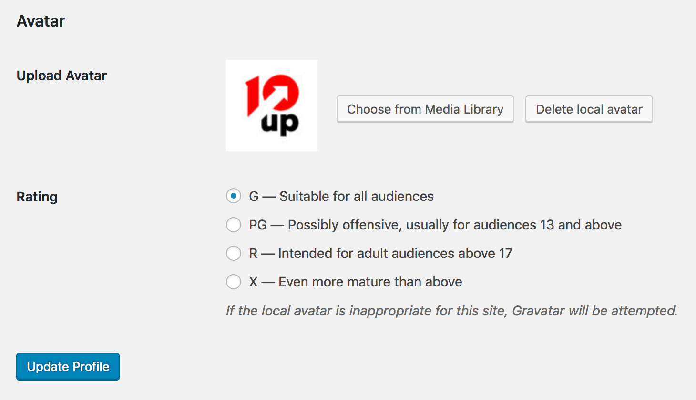

# Simple Local Avatars

> Adds an avatar upload field to user profiles. Generates requested sizes on demand just like Gravatar!

   

    

## Features

Adds an avatar upload field to user profiles if the current user has media permissions. Generates requested sizes on demand just like Gravatar! Simple and lightweight.

Just edit a user profile, and scroll down to the new "Avatar" field. The plug-in will take care of cropping and sizing!

1. Stores avatars in the "uploads" folder where all of your other media is kept
2. Has a simple, native interface
3. Fully supports Gravatar and default avatars if no local avatar is set for the user - but also allows you turn off Gravatar
4. Generates the requested avatar size on demand (and stores the new size for efficiency), so it looks great, just like Gravatar!
5. Lets you decide whether lower privilege users (subscribers, contributors) can upload their own avatar
6. Enables rating of local avatars, just like Gravatar

## Installation

1. Install easily with the WordPress plugin control panel or manually download the plugin and upload the extracted folder to the `/wp-content/plugins/` directory
2. Activate the plugin through the 'Plugins' menu in WordPress
3. If you only want users with file upload capabilities to upload avatars, check the applicable option under Settings > Discussion
4. Start uploading avatars by editing user profiles!

Use avatars in your theme using WordPress' built in `get_avatar()` function: [http://codex.wordpress.org/Function_Reference/get_avatar](http://codex.wordpress.org/Function_Reference/get_avatar "get_avatar function")

You can also use `get_simple_local_avatar()` (with the same arguments) to retrieve local avatars a bit faster, but this will make your theme dependent on this plug-in.

## Frequently Asked Questions

### Does Simple Local Avatars collect personal data of website visitors?

No.  Simple Local Avatars neither collects, stores, nor sends any PII data of visitors or avatar users on the host site or to 10up or other services.

## Support Level

**Stable:** 10up is not planning to develop any new features for this, but will still respond to bug reports and security concerns. We welcome PRs, but any that include new features should be small and easy to integrate and should not include breaking changes. We otherwise intend to keep this tested up to the most recent version of WordPress.

## Contributing

Please read [CODE_OF_CONDUCT.md](https://github.com/10up/simple-local-avatars/blob/develop/CODE_OF_CONDUCT.md) for details on our code of conduct and [CONTRIBUTING.md](https://github.com/10up/simple-local-avatars/blob/develop/CONTRIBUTING.md) for details on the process for submitting pull requests to us.

## Like what you see?

